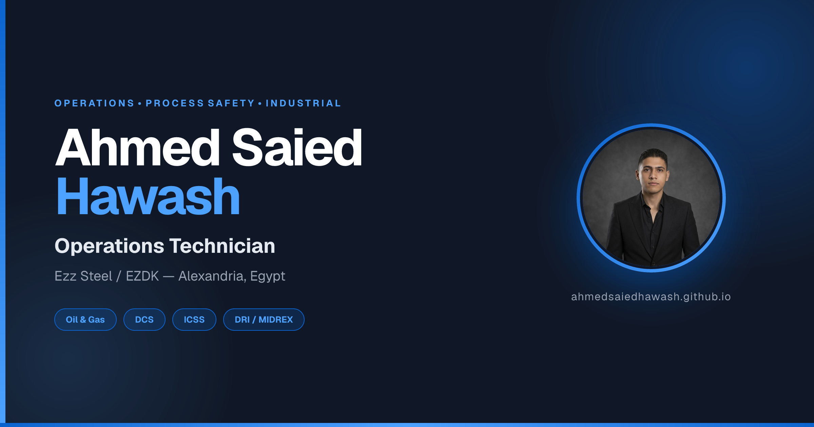

# Ahmed Saied Hawash — Personal Portfolio

<div align="center">



**Operations Technician | Oil & Gas | Petrochemical | DCS/ICSS | Process Safety**

[](https://ahmedsaiedhawash.github.io/)
[](https://www.linkedin.com/in/ahmedsaiedhawash/)
[](https://github.com/ahmedsaiedhawash)

</div>

---

## 🌍 Overview

A modern, bilingual (English & Arabic), fully responsive personal portfolio website designed to showcase professional experience, certifications, and technical skills in **industrial operations, offshore Oil & Gas production, and petrochemical processing**.

Built with **vanilla HTML, CSS, and JavaScript** — no frameworks, no build tools, no dependencies. Deployed on **GitHub Pages**.

| | |
|:---|:---|
| 🌐 **Live Website** | [ahmedsaiedhawash.github.io](https://ahmedsaiedhawash.github.io/) |
| 🇬🇧 **English Version** | [ahmedsaiedhawash.github.io](https://ahmedsaiedhawash.github.io/) |
| 🇪🇬 **Arabic Version** | [ahmedsaiedhawash.github.io/ar.html](https://ahmedsaiedhawash.github.io/ar.html) |
| 📅 **Last Updated** | October 2026 |

---

## ✨ Key Features

### 🎨 Design & UX
- **Modern, minimal, industrial-inspired** design
- **Dark / Light mode** with system preference detection
- **Fully responsive** — mobile, tablet, desktop, and 4K screens
- **Smooth scroll reveal** animations using `IntersectionObserver`
- **Reading progress bar** and **back-to-top** button
- **Certificate lightbox** with keyboard navigation (`←`, `→`, `Esc`)

### 🌐 Bilingual Support (i18n)
- Complete **English (EN)** and **Arabic (AR)** versions
- Full **RTL (Right-to-Left)** support for Arabic
- **Cairo** font for Arabic, **Inter** for English
- **Technical/professional terms kept in English** within the Arabic version (e.g., DCS, ICSS, PSM) for industry accuracy
- Language preference saved in `localStorage`
- **`hreflang` tags** for correct search engine indexing

### 📊 Data-Driven Architecture
- **Two separate JSON files** — one per language (`data-en.json`, `data-ar.json`)
- **`renderer.js`** dynamically loads the correct file based on `<html lang>`
- **Zero HTML edits** required for content updates
- **Fallback content** in HTML ensures the site remains functional even if JSON fails to load

### 🔍 SEO & Performance
- **Open Graph** + **Twitter Cards** for rich social media previews
- **Structured Data (JSON-LD)** — `Person`, `WebSite`, `ProfilePage`, `BreadcrumbList`, `Organization`
- **`sitemap.xml`** with hreflang alternates
- **`robots.txt`** configured
- **Preload & Preconnect** for critical resources
- **Lazy loading** for images below the fold
- **Google Search Console** verified

### 📱 PWA (Progressive Web App)
- **`manifest.json`** with shortcuts and screenshots
- **Service Worker** for offline support
- Installable on mobile home screens
- Theme color matching brand identity

### 📬 Contact & Communication
- **Contact form** via [Web3Forms](https://web3forms.com/)
- **WhatsApp floating button** with pulsing animation
- **7 direct contact cards** (Facebook, LinkedIn, GitHub, Instagram, Twitter/X, Email, Phone)
- **Honeypot** field for spam protection

### ♿ Accessibility
- Semantic HTML5 (`<main>`, `<section>`, `<article>`, `<nav>`)
- **ARIA labels** on all interactive elements
- **Keyboard navigable** with `:focus-visible` styling
- **`prefers-reduced-motion`** support
- **Skip-to-content** link
- **High contrast** color combinations

---

## 🛠️ Tech Stack

| Layer | Technology |
|:---|:---|
| **Markup** | HTML5 (semantic) |
| **Styling** | CSS3 (Custom Properties, Grid, Flexbox, Animations) |
| **Scripting** | Vanilla JavaScript (ES6+) |
| **Data** | JSON (split-file i18n) |
| **Fonts** | Google Fonts (Inter + Cairo) |
| **Analytics** | Google Analytics 4 |
| **Forms** | Web3Forms API |
| **Hosting** | GitHub Pages |
| **PWA** | Service Worker + Manifest |

**No build tools. No npm. No bundlers. Just open-source web standards.**

---

## 📁 Project Structure

```
ahmedsaiedhawash.github.io/
│
├── index.html                    # English homepage
├── ar.html                       # Arabic homepage
├── 404.html                      # Custom 404 page (bilingual)
│
├── style.css                     # All styles (with RTL support)
├── script.js                     # Core interactions
├── renderer.js                   # Dynamic content loader
├── sw.js                         # Service Worker (PWA)
│
├── data-en.json                  # ← English content (EDIT HERE)
├── data-ar.json                  # ← Arabic content (EDIT HERE)
│
├── manifest.json                 # PWA manifest
├── robots.txt                    # SEO crawler rules
├── sitemap.xml                   # SEO sitemap
│
├── google876f3c20d9b90585.html   # Google Search Console verification
│
├── images/                       # All images
│   ├── ahmed-saied-hawash_profile.jpg
│   ├── Ahmed-Saied-Hawash_about.jpg
│   ├── Ahmed-Saied-Hawash_og.png
│   ├── ezz-bg.jpg
│   ├── ezz-logo.png
│   ├── Ahmed-Saied-Hawash_abuqir-bg.jpg
│   ├── abuqir-logo.png
│   ├── Ahmed-Saied-Hawash_iicp-bg.jpg
│   ├── iicp-logo.png
│   ├── opito-logo.png
│   ├── nasp-logo.png
│   ├── petroleum-logo.png
│   ├── gammaltech-logo.png
│   ├── cert-bosiet.jpg
│   ├── cert-osha.jpg
│   ├── cert-life-saving.jpg
│   ├── cert-petroleum.jpg
│   ├── cert-cybersecurity.jpg
│   ├── favicon.png
│   ├── apple-touch-icon.png
│   ├── icon-192.png
│   └── icon-512.png
│
└── certificates/                 # PDF certificates
    ├── BOSIET-HUET.pdf
    ├── OSHA-30.pdf
    ├── Life-Saving-Rules.pdf
    ├── Petroleum-Industry-Fundamentals.pdf
    └── Cybersecurity-101.pdf
```

---

## ✏️ How to Update Content

**The entire site is data-driven.** All text is split across **two language-specific JSON files**:

| File | Language | When to Edit |
|:---|:---:|:---|
| `data-en.json` | 🇬🇧 English | For changes to the English version |
| `data-ar.json` | 🇪🇬 Arabic | For changes to the Arabic version |

### 📝 To update your information:

1. Open the relevant file in any text editor.
2. Find the section you want to edit:
   - `hero` → Name, title, description
   - `about` → Professional bio, info card
   - `career` → Work experience
   - `certifications` → Certificates
   - `education` → Education details
   - `skills` → Technical skills
   - `contact` → Contact information
3. Edit the values (keep the structure and quotes intact).
4. Save and commit to GitHub.

> **⚠️ Important:** Both files are loaded dynamically at page load based on `<html lang>`. No HTML edits needed.

### 🖼️ To add a new image:

1. Place the image in the `images/` folder.
2. Reference it in the correct JSON file (e.g., `"logo": "new-logo.png"`).
3. The site will automatically display it.

### 🌍 To add a new language (e.g., French):

1. Create `data-fr.json` (copy from `data-en.json` and translate).
2. Create `fr.html` (copy of `index.html`, change `lang="fr"`).
3. Update `renderer.js` → `DATA_FILES` map:
   ```js
   const DATA_FILES = {
       en: 'data-en.json',
       ar: 'data-ar.json',
       fr: 'data-fr.json'
   };
   ```
4. Add `<link rel="alternate" hreflang="fr" ...>` to all HTML files.
5. Update `sitemap.xml` to include the new language.

---

## 🚀 Deployment

This project is **automatically deployed** via GitHub Pages.

### To deploy updates:

```bash
git add .
git commit -m "Update: <description>"
git push origin main
```

GitHub Pages will **automatically redeploy** within 1–2 minutes.

> **Note:** This repository uses **"Deploy from a branch"** mode (not GitHub Actions), for maximum stability.

---

## 🔐 Privacy & Security

- **No tracking** beyond Google Analytics 4 (anonymized IP).
- **Contact form** is powered by Web3Forms — your email is never exposed in HTML.
- **HTTPS enforced** via GitHub Pages.
- **No cookies** (only `localStorage` for theme and language preferences).

---

## 📊 SEO Checklist

- [x] Semantic HTML5 structure
- [x] Unique `<title>` and `<meta description>` per page
- [x] Open Graph + Twitter Cards
- [x] Structured Data (JSON-LD)
- [x] Canonical URLs
- [x] `hreflang` tags (EN + AR)
- [x] `sitemap.xml` with hreflang alternates
- [x] `robots.txt` configured
- [x] Mobile-friendly (responsive)
- [x] Fast loading (no frameworks)
- [x] HTTPS enabled
- [x] Google Search Console verified
- [x] Google Analytics 4 integrated

---

## 📱 PWA Features

- **Installable** on Android and iOS
- **Offline support** for cached pages
- **App shortcuts** (CV, Contact)
- **Splash screen** (theme color)
- **Standalone display mode**

---

## 🧪 Browser Support

| Browser | Support |
|:---|:---:|
| Chrome / Edge | ✅ Latest 2 versions |
| Firefox | ✅ Latest 2 versions |
| Safari (macOS / iOS) | ✅ Latest 2 versions |
| Samsung Internet | ✅ Latest 2 versions |
| Opera | ✅ Latest 2 versions |

**Not supported:** Internet Explorer (deprecated).

---

## 🤝 Contributing

This is a **personal portfolio**, so contributions are not expected. However, if you spot a bug or have a suggestion:

1. Open an **issue** with a detailed description.
2. Or send a message via the [contact form](https://ahmedsaiedhawash.github.io/#contact).

---

## 📄 License

This project is licensed under the **MIT License** — you're free to use it as a template for your own portfolio.

**However:**
- ❌ **Please do NOT copy my personal data, images, or certificates.**
- ✅ **You ARE welcome to use the code structure, design, and layout.**

For commercial use of the code, attribution is appreciated but not required.

---

## 👤 Author

<div align="center">

### **Ahmed Saied Hawash**

**Operations Technician** at Ezz Steel (EZDK)
📍 Alexandria, Egypt

[](mailto:ahmedsaiedhawash@gmail.com)
[](tel:+201091570288)
[](https://www.linkedin.com/in/ahmedsaiedhawash/)

</div>

---

<div align="center">

**⭐ If you found this project useful, consider giving it a star! ⭐**

_Made with ❤️ in Alexandria, Egypt_

© 2026 Ahmed Saied Hawash. All rights reserved.

</div>
      
